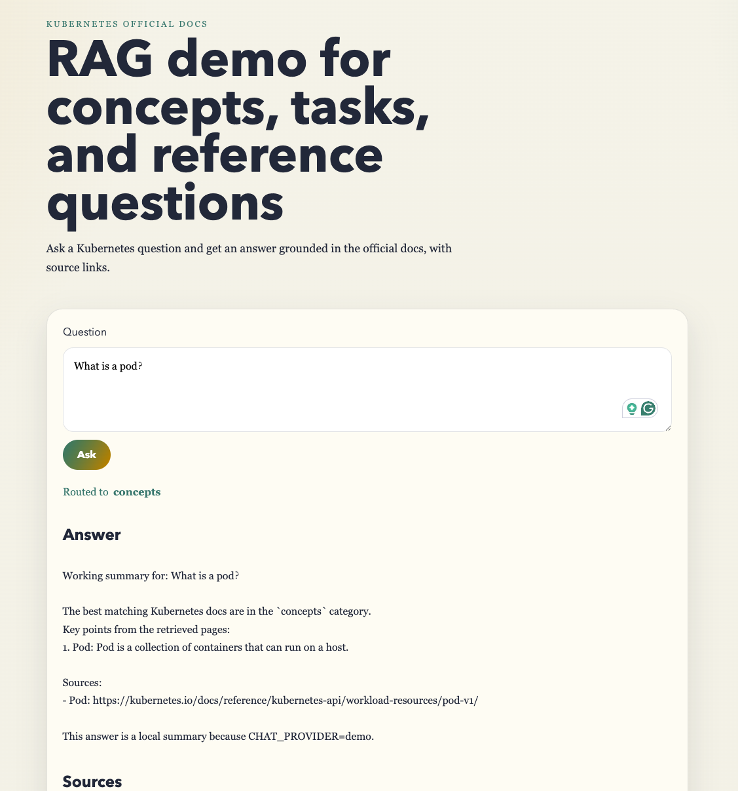
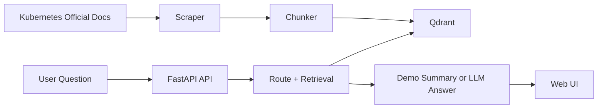
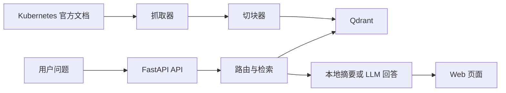

# Kubernetes Docs RAG

English | [中文](#中文说明)

A lightweight Retrieval-Augmented Generation (RAG) demo built on top of the Kubernetes official documentation.

This project focuses on:
- scraping selected pages from the official Kubernetes docs
- chunking and indexing the content into Qdrant
- routing questions across `concepts`, `tasks`, and `reference`
- serving a simple web UI with a FastAPI backend



## Architecture



## English

### Features

- FastAPI backend with a minimal browser UI
- Scraper for official Kubernetes docs content
- Metadata-aware chunking by heading structure
- Qdrant-backed vector search
- Query routing for concept, how-to, and reference questions
- `demo` mode for local testing without OpenAI quota

### Demo Preview

This repository includes an instant-demo dataset so a fresh clone can start quickly without scraping the full docs corpus first.

Suggested demo questions:
- `What is a Kubernetes Service?`
- `What is a ConfigMap?`
- `How do I install kubectl on macOS?`
- `What fields are in Deployment spec?`

### Project Structure

```text
kubernetes-docs-rag/
  app/                  # FastAPI app and frontend assets
  docker/               # Docker Compose for Qdrant
  scripts/              # Scraping and indexing scripts
  data/                 # Local runtime data (ignored by git)
  pyproject.toml
  README.md
```

### Tech Stack

- Python
- FastAPI
- Qdrant
- BeautifulSoup + httpx
- OpenAI API or local demo mode

### Quick Start

1. Create and activate a Python virtual environment.
2. Install dependencies:

```bash
pip install -e .
```

3. Copy the example environment file:

```bash
cp .env.example .env
```

4. Start Qdrant:

```bash
docker compose -f docker/docker-compose.yml up -d
```

5. Scrape and index docs:

```bash
python -m scripts.scrape_docs
python -m scripts.index_docs
```

6. Run the app:

```bash
uvicorn app.main:app --reload
```

Then open [http://127.0.0.1:8000](http://127.0.0.1:8000).

### Instant Demo

If you want a fast demo without scraping the full documentation set:

```bash
cp .env.example .env
docker compose -f docker/docker-compose.yml up -d
python -m scripts.index_sample_docs
uvicorn app.main:app --reload
```

This uses the committed sample dataset in `data/sample/sample_chunks.jsonl`, so a fresh clone can run immediately.

### Environment Variables

See `.env.example` for supported configuration:

- `OPENAI_API_KEY`
- `QDRANT_URL`
- `QDRANT_COLLECTION`
- `OPENAI_EMBEDDING_MODEL`
- `OPENAI_CHAT_MODEL`
- `TOP_K`
- `EMBEDDING_PROVIDER`
- `CHAT_PROVIDER`

### Demo Mode

If you do not want to use OpenAI yet, keep:

```env
EMBEDDING_PROVIDER=demo
CHAT_PROVIDER=demo
```

In demo mode:
- embeddings are deterministic local vectors
- answers are assembled locally from retrieved Kubernetes docs passages

### Notes

- Runtime data under `data/` is intentionally excluded from git.
- Local secrets such as `.env` are intentionally excluded from git.
- This repository is a demo project, not a production-ready RAG service.

## 中文说明

这是一个基于 Kubernetes 官方文档构建的轻量级 RAG 示例项目。

项目目标是演示一条完整但不过度复杂的链路：
- 抓取 Kubernetes 官方文档
- 按标题结构切块并附加元数据
- 写入 Qdrant 向量库
- 对问题做 `concepts`、`tasks`、`reference` 分流
- 通过 FastAPI 和简单网页界面对外提供问答能力

## 架构图



### 功能特点

- 使用 FastAPI 提供后端接口和最小前端页面
- 支持抓取 Kubernetes 官方文档内容
- 按文档标题层级切块
- 使用 Qdrant 做向量检索
- 支持解释型、操作型、参考型问题分流
- 提供 `demo` 模式，便于本地无额度时演示

### Demo 预览建议

仓库内已经带有一个可直接运行的小样本数据集，因此 fresh clone 后也可以快速演示。

建议直接测试这些问题：
- `What is a Kubernetes Service?`
- `What is a ConfigMap?`
- `How do I install kubectl on macOS?`
- `What fields are in Deployment spec?`

### 目录结构

```text
kubernetes-docs-rag/
  app/                  # FastAPI 应用和前端静态资源
  docker/               # Qdrant 的 Docker Compose 配置
  scripts/              # 抓取和索引脚本
  data/                 # 本地运行时数据（不会提交到 git）
  pyproject.toml
  README.md
```

### 技术栈

- Python
- FastAPI
- Qdrant
- BeautifulSoup + httpx
- OpenAI API 或本地 demo 模式

### 快速开始

1. 创建并激活 Python 虚拟环境
2. 安装依赖：

```bash
pip install -e .
```

3. 复制环境变量模板：

```bash
cp .env.example .env
```

4. 启动 Qdrant：

```bash
docker compose -f docker/docker-compose.yml up -d
```

5. 抓取并建立索引：

```bash
python -m scripts.scrape_docs
python -m scripts.index_docs
```

6. 启动应用：

```bash
uvicorn app.main:app --reload
```

然后在浏览器打开 [http://127.0.0.1:8000](http://127.0.0.1:8000)。

### 快速 Demo

如果你想在刚 clone 下来后立刻跑一个最小演示，而不先抓取完整文档，可以直接执行：

```bash
cp .env.example .env
docker compose -f docker/docker-compose.yml up -d
python -m scripts.index_sample_docs
uvicorn app.main:app --reload
```

这条路径会使用仓库里已经提交的 `data/sample/sample_chunks.jsonl`，因此新用户拿到项目后可以马上启动一个 demo。

### 环境变量

可配置项见 `.env.example`，主要包括：

- `OPENAI_API_KEY`
- `QDRANT_URL`
- `QDRANT_COLLECTION`
- `OPENAI_EMBEDDING_MODEL`
- `OPENAI_CHAT_MODEL`
- `TOP_K`
- `EMBEDDING_PROVIDER`
- `CHAT_PROVIDER`

### Demo 模式

如果暂时不使用 OpenAI，可以保留：

```env
EMBEDDING_PROVIDER=demo
CHAT_PROVIDER=demo
```

在 demo 模式下：
- embedding 使用本地确定性向量
- 回答由本地根据检索片段整理生成

### 说明

- `data/` 下的运行数据默认不会提交到仓库
- `.env` 等本地配置和密钥不会提交到仓库
- 这是一个示例项目，不是生产级 RAG 系统
